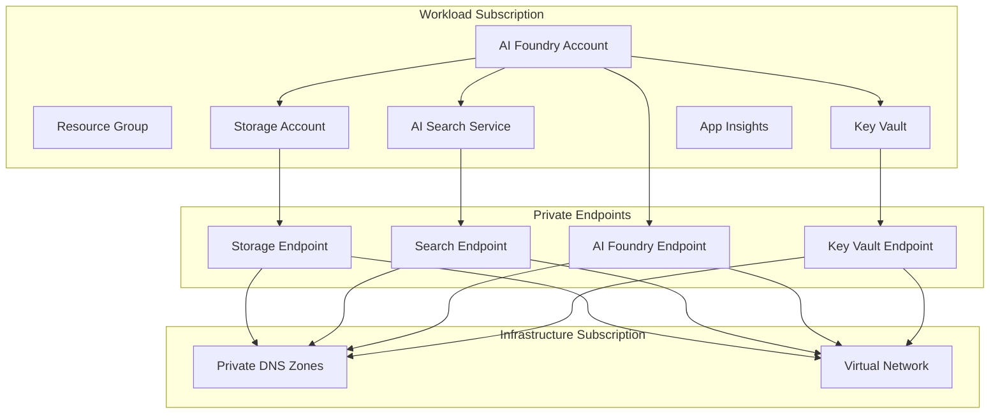

# Azure AI Foundry Infrastructure

Terraform configuration for deploying Azure AI Foundry with private networking and cross-subscription support.

## Overview

This deployment provides a production-ready Azure AI Foundry setup with:

- **Azure AI Foundry** - Core AI platform with GPT-4o model
- **Private networking** - Secure connectivity with private endpoints
- **Cross-subscription** - Separate workload and infrastructure subscriptions
- **Storage & Search** - Integrated storage account and AI search service
- **Monitoring** - Application Insights and diagnostic settings
- **Security** - RBAC, managed identities, and optional Key Vault

## Quick Start

1. **Configure your environment**:
   ```bash
   cp terraform.tfvars.example terraform.tfvars
   # Edit terraform.tfvars with your subscription IDs and network settings
   ```

2. **Deploy**:
   ```bash
   terraform init
   terraform plan
   terraform apply
   ```

## Architecture



## Prerequisites

- **Azure Subscriptions**: Two subscriptions recommended (workload and infrastructure)
- **Existing Network**: VNet with subnets for private endpoints
- **DNS Zones**: Private DNS zones created and linked to VNet
- **Permissions**: Contributor access to both subscriptions
- **Tools**: Terraform >= 1.0, Azure CLI

## Configuration

### 1. Network Setup

Before deployment, ensure you have:

- Virtual network with subnet for private endpoints
- Private DNS zones for:
  - `privatelink.cognitiveservices.azure.com`
  - `privatelink.openai.azure.com`
  - `privatelink.services.ai.azure.com`
  - `privatelink.blob.core.windows.net`
  - `privatelink.search.windows.net`
  - `privatelink.vaultcore.azure.net`

### 2. Configure Variables

```bash
cp terraform.tfvars.example terraform.tfvars
```

Update `terraform.tfvars` with your:
- Subscription IDs
- Resource group names
- Network subnet IDs
- DNS zone resource IDs
- Admin users/groups

### 3. Deploy

```bash
# Initialize Terraform
terraform init

# Review the plan
terraform plan

# Deploy infrastructure
terraform apply
```

## Environment Configuration

The deployment automatically configures resources based on the `environment` variable:

| Setting | dev | staging | prod |
|---------|-----|---------|------|
| Storage SKU | Standard_LRS | Standard_ZRS | Premium_ZRS |
| Search SKU | basic | standard | standard |
| Key Vault SKU | standard | standard | premium |
| Backup | disabled | enabled | enabled |
| Monitoring | basic | standard | comprehensive |

## Features

### Private Networking
- All services deployed with private endpoints
- Cross-subscription networking support
- Secure communication between components

### Security
- Managed identity authentication
- Optional customer-managed encryption
- RBAC with least-privilege access
- Network isolation

### Monitoring
- Application Insights integration
- Diagnostic settings for all resources
- Optional alerting configuration
- Centralized logging

## Outputs

After deployment, you'll get:
- AI Foundry account details
- Storage account information
- Search service endpoints
- Connection strings for applications

## Cost Optimization

This configuration is optimized for cost by:
- Using appropriate SKUs for each environment
- Enabling features based on environment needs
- Optional encryption (Key Vault creation)
- Configurable monitoring levels

## Troubleshooting

### Common Issues

**Cross-subscription permissions**:
```bash
# Ensure you have access to both subscriptions
az account list --query "[].{Name:name, Id:id, State:state}"
```

**Private endpoint deployment failures**:
- Verify DNS zones exist and are linked to the VNet
- Check subnet has sufficient IP addresses
- Ensure proper permissions on target VNet

**Resource naming conflicts**:
- The configuration uses random suffixes to avoid conflicts
- Check existing resources if deployment fails

## Contributing

See [CONTRIBUTING.md](CONTRIBUTING.md) for development setup and contribution guidelines.

## License

This project is licensed under the MIT License - see [LICENSE](LICENSE) for details.

---

# Azure AI Foundry Project based Deployment

> **NoCapabilityHosts Configuration** - Streamlined Azure AI Foundry deployment without compute infrastructure

## 🏗️ Architecture Overview

```
┌─────────────────────────────────────────────────────────────┐
│                     Azure AI Foundry                        │
│  ┌──────────────┐    ┌──────────────┐    ┌──────────────┐   │
│  │ AI Foundry   │    │   Storage    │    │  AI Search   │   │
│  │   Account    │    │   Account    │    │   Service    │   │
│  │              │    │              │    │              │   │
│  └──────────────┘    └──────────────┘    └──────────────┘   │
│          │                    │                    │        │
│          ▼                    ▼                    ▼        │
│  ┌──────────────┐    ┌──────────────┐    ┌──────────────┐   │
│  │ AI Foundry   │    │   Private    │    │   Private    │   │
│  │   Project    │    │  Endpoint    │    │  Endpoint    │   │
│  │              │    │   (Storage)  │    │  (Search)    │   │
│  └──────────────┘    └──────────────┘    └──────────────┘   │
│          │                                                  │
│          ▼                                                  │
│  ┌──────────────┐    ┌──────────────────────────────────┐   │
│  │   OpenAI     │    │         Monitoring               │   │
│  │ Deployment   │    │  • Application Insights          │   │
│  │  (GPT-4o)    │    │  • Log Analytics Workspace       │   │
│  └──────────────┘    │  • Diagnostic Settings           │   │
│                      └──────────────────────────────────┘   │
└─────────────────────────────────────────────────────────────┘
```

## 📋 Prerequisites

- Azure subscription with appropriate permissions
- Terraform >= 1.5.0
- Azure CLI installed and authenticated
- A virtual network with subnets for private endpoints (if using private endpoints)

## 🚀 Quick Start

1. **Clone and navigate to the simplified deployment:**
   ```bash
   cd terraform-foundry-nocaphost
   ```

2. **Initialize Terraform:**
   ```bash
   terraform init
   ```

3. **Create a terraform.tfvars file:**
   ```bash
   # Copy the example template
   cp terraform.tfvars.example terraform.tfvars
   
   # Edit with your specific values
   nano terraform.tfvars  # or use your preferred editor
   ```

   **Required configuration updates:**
   ```hcl
   # Core settings
   project_name = "your-ai-project"
   environment  = "dev"               # or staging/prod
   location     = "eastus2"           # your preferred region
   
   # Subscription IDs (REQUIRED - replace with your values)
   subscription_id_resources = "your-workload-subscription-id"
   subscription_id_infra     = "your-infrastructure-subscription-id"
   
   # Resource groups
   resource_group_name_resources = "rg-ai-workload"
   resource_group_name_dns       = "rg-dns-zones"
   
   # Networking (REQUIRED if using private endpoints)
   subnet_id_private_endpoint = "/subscriptions/.../subnets/your-endpoint-subnet"
   
   # Private DNS zones (REQUIRED for private endpoints)
   dns_zone_cognitiveservices = "/subscriptions/.../privatelink.cognitiveservices.azure.com"
   dns_zone_openai           = "/subscriptions/.../privatelink.openai.azure.com"
   dns_zone_ai_services      = "/subscriptions/.../privatelink.services.ai.azure.com"
   storage_blob_dns_zone_id  = "/subscriptions/.../privatelink.blob.core.windows.net"
   search_dns_zone_id        = "/subscriptions/.../privatelink.search.windows.net"
   
   # Admin access (REQUIRED - replace with your email/group IDs)
   platform_admin_users = ["your-email@company.com"]
   platform_admin_groups = ["your-azure-ad-group-id"]
   ```

4. **Plan and apply:**
   ```bash
   terraform plan
   terraform apply
   ```

## 🔧 Configuration Options

### Essential Variables

| Variable | Description | Default |
|----------|-------------|---------|
| `project_name` | Name of the project | Required |
| `environment` | Environment (dev/staging/prod) | Required |
| `location` | Azure region | Required |
| `resource_group_name` | Resource group name | Required |

### Private Endpoints

| Variable | Description | Default |
|----------|-------------|---------|
| `enable_private_endpoints` | Enable private endpoints | `true` |
| `subnet_id_private_endpoint` | Subnet for private endpoints | `null` |

### Security Features

| Variable | Description | Default |
|----------|-------------|---------|
| `create_key_vault` | Create Key Vault for secrets | `false` |
| `enable_customer_managed_keys` | Use customer-managed encryption | `false` |

## 📊 Monitoring

The deployment includes comprehensive monitoring:

- **Application Insights** - Application performance monitoring
- **Log Analytics Workspace** - Centralized logging
- **Diagnostic Settings** - Resource-level diagnostics
- **Metric Alerts** - Monitoring for key metrics

Access monitoring data through:
- Azure Portal > Application Insights
- Azure Portal > Log Analytics Workspace
- Azure Monitor workbooks

## 🔐 Security

Built-in security features:

- **Private Endpoints** - Secure network connectivity
- **RBAC Permissions** - Least-privilege access
- **Network Security Groups** - Network-level protection
- **Optional Key Vault** - Secrets and key management

## 🎯 Use Cases

This simplified deployment is ideal for:

- **Development environments** - Lower cost for testing
- **Proof of concepts** - Quick AI platform setup
- **Simple AI applications** - Basic chat, search, and generation
- **Cost-conscious deployments** - When capability hosts aren't needed
- **Learning and experimentation** - Understanding AI Foundry basics

## ⚠️ Limitations

Be aware of these limitations:

- **No compute infrastructure** - Capability hosts not available
- **No document database** - Cosmos DB not included
- **Simplified networking** - Basic private endpoint setup
- **Limited scalability** - No auto-scaling VM infrastructure

## 🔄 Migration to Full Deployment

To migrate to the full deployment with capability hosts:

1. Use the main `terraform-foundry-agent` configuration
2. Add Cosmos DB variables to your terraform.tfvars
3. Configure agent subnet network injection
4. Plan migration carefully to avoid resource conflicts

## 📚 Additional Resources

- [Azure AI Foundry Documentation](https://docs.microsoft.com/azure/ai-foundry/)
- [Azure OpenAI Service](https://docs.microsoft.com/azure/cognitive-services/openai/)
- [Azure AI Search](https://docs.microsoft.com/azure/search/)
- [Azure Private Endpoints](https://docs.microsoft.com/azure/private-link/)

## 🐛 Troubleshooting

Common issues and solutions:

1. **Private endpoint connectivity issues**
   - Verify subnet configuration
   - Check DNS resolution
   - Validate NSG rules

2. **RBAC permission errors**
   - Verify managed identity roles
   - Check resource-level permissions
   - Validate user/group assignments

3. **OpenAI deployment failures**
   - Check regional availability
   - Verify subscription quotas
   - Validate model versions

## 🤝 Support

For issues specific to this simplified deployment:

1. Check the troubleshooting section above
2. Review Terraform plan output for errors
3. Verify Azure resource configurations
4. Compare with the full deployment if needed
