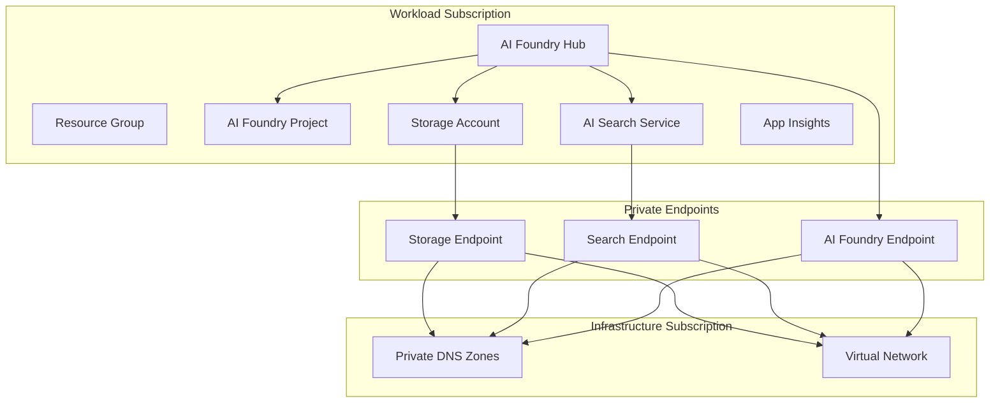

# Azure AI Foundry Infrastructure

> **Complete Azure AI Foundry Terraform Configurations** - Deploy AI Foundry with or without capability hosts

This repository provides production-ready Terraform configurations for deploying Azure AI Foundry with private networking and cross-subscription support.

## 🚀 Deployment Options

Choose the configuration that best fits ## 📁 Repository Structur## 📚 Additional Resourcesour requirements:

### 🏃‍♂️ Quick Start: NoCapabilityHosts (Current Directory)
**Simplified configuration** - Cost-optimized deployment without compute infrastructure

- ✅ **Lower cost** (~30% reduction vs capability hosts)
- ✅ **Faster deployment** (5-8 minutes)  
- ✅ **Perfect for development** and simple AI applications
- ❌ No capability hosts for custom runtimes
- ❌ No Cosmos DB for conversation storage

**Start here** → [Continue with current configuration](#what-this-deploys)

### 🏗️ Full Deployment: WithCapabilityHosts
**Enterprise configuration** - Complete AI Foundry with Standard Agent support

- ✅ **Capability hosts** for bring-your-own Azure resources
- ✅ **Cosmos DB** for thread and conversation storage
- ✅ **Agent subnet injection** for network-secured deployments
- ✅ **Standard Agent** runtime support
- ⚠️ Higher cost and complexity

**Enterprise setup** → [Switch to terraform-foundry-caphost/](./terraform-foundry-caphost/)

## ✨ What This Deploys

This deployment provides a **cost-optimized** Azure AI Foundry setup with:

- **Azure AI Foundry Hub & Project** - Core AI platform with GPT-4o model
- **Private networking** - Secure connectivity with private endpoints  
- **Cross-subscription support** - Separate workload and infrastructure subscriptions
- **Storage & Search** - Integrated storage account and AI search service
- **Monitoring** - Application Insights and diagnostic settings
- **Security** - RBAC, managed identities, and optional Key Vault
- **Simplified Architecture** - No capability hosts or Cosmos DB for reduced cost

## 🏗️ Architecture

```
┌─────────────────────────────────────────────────────────────┐
│                     Azure AI Foundry                        │
│  ┌──────────────┐    ┌──────────────┐    ┌──────────────┐   │
│  │ AI Foundry   │    │   Storage    │    │  AI Search   │   │
│  │   Hub        │    │   Account    │    │   Service    │   │
│  │              │    │              │    │              │   │
│  └──────────────┘    └──────────────┘    └──────────────┘   │
│          │                    │                    │        │
│          ▼                    ▼                    ▼        │
│  ┌──────────────┐    ┌──────────────┐    ┌──────────────┐   │
│  │ AI Foundry   │    │   Private    │    │   Private    │   │
│  │   Project    │    │  Endpoint    │    │  Endpoint    │   │
│  │              │    │   (Storage)  │    │  (Search)    │   │
│  └──────────────┘    └──────────────┘    └──────────────┘   │
│          │                                                  │
│          ▼                                                  │
│  ┌──────────────┐    ┌──────────────────────────────────┐   │
│  │   OpenAI     │    │         Monitoring               │   │
│  │ Deployment   │    │  • Application Insights          │   │
│  │  (GPT-4o)    │    │  • Log Analytics Workspace       │   │
│  └──────────────┘    │  • Diagnostic Settings           │   │
│                      └──────────────────────────────────┘   │
└─────────────────────────────────────────────────────────────┘
```

### Cross-Subscription Architecture



## 📋 Prerequisites

- **Azure Subscriptions**: Two subscriptions recommended (workload and infrastructure)
- **Existing Network**: VNet with subnets for private endpoints
- **DNS Zones**: Private DNS zones created and linked to VNet
- **Permissions**: Contributor access to both subscriptions
- **Tools**: Terraform >= 1.5.0, Azure CLI

### Required Private DNS Zones

Before deployment, ensure you have these private DNS zones:
- `privatelink.cognitiveservices.azure.com`
- `privatelink.openai.azure.com` 
- `privatelink.services.ai.azure.com`
- `privatelink.blob.core.windows.net`
- `privatelink.search.windows.net`
- `privatelink.vaultcore.azure.net` (optional, for Key Vault)

## 🚀 Quick Start

1. **Clone and navigate to the repository:**
   ```bash
   git clone <repository-url>
   cd terraform-foundry-nocaphost
   ```

2. **Initialize Terraform:**
   ```bash
   terraform init
   ```

3. **Set up environment variables:**
   ```bash
   # Required for Azure Storage backend authentication
   export ARM_SUBSCRIPTION_ID="your-infrastructure-subscription-id"
   ```
   > **Note:** The `ARM_SUBSCRIPTION_ID` should be set to the subscription containing the Terraform state storage account.

4. **Create a terraform.tfvars file:**
   ```bash
   # Copy the example template
   cp terraform.tfvars.example terraform.tfvars
   
   # Edit with your specific values
   nano terraform.tfvars  # or use your preferred editor
   ```

   **Required configuration updates:**
   ```hcl
   # Core settings
   project_name = "your-ai-project"
   environment  = "dev"               # or staging/prod
   location     = "eastus2"           # your preferred region
   
   # Subscription IDs (REQUIRED - replace with your values)
   subscription_id_resources = "your-workload-subscription-id"
   subscription_id_infra     = "your-infrastructure-subscription-id"
   
   # Resource groups
   resource_group_name_resources = "rg-ai-workload"
   resource_group_name_dns       = "rg-dns-zones"
   
   # Networking (REQUIRED if using private endpoints)
   subnet_id_private_endpoint = "/subscriptions/.../subnets/your-endpoint-subnet"
   
   # Private DNS zones (REQUIRED for private endpoints)
   dns_zone_cognitiveservices = "/subscriptions/.../privatelink.cognitiveservices.azure.com"
   dns_zone_openai           = "/subscriptions/.../privatelink.openai.azure.com"
   dns_zone_ai_services      = "/subscriptions/.../privatelink.services.ai.azure.com"
   storage_blob_dns_zone_id  = "/subscriptions/.../privatelink.blob.core.windows.net"
   search_dns_zone_id        = "/subscriptions/.../privatelink.search.windows.net"
   
   # Admin access (REQUIRED - replace with your email/group IDs)
   platform_admin_users = ["your-email@company.com"]
   platform_admin_groups = ["your-azure-ad-group-id"]
   ```

5. **Plan and deploy:**
   ```bash
   terraform plan
   terraform apply
   ```

## 🔧 Configuration Options

### Essential Variables

| Variable | Description | Default |
|----------|-------------|---------|
| `project_name` | Name of the project | Required |
| `environment` | Environment (dev/staging/prod) | Required |
| `location` | Azure region | Required |
| `resource_group_name_resources` | Resource group name | Required |

### Private Endpoints

| Variable | Description | Default |
|----------|-------------|---------|
| `enable_private_endpoints` | Enable private endpoints | `true` |
| `subnet_id_private_endpoint` | Subnet for private endpoints | `null` |

### Security Features

| Variable | Description | Default |
|----------|-------------|---------|
| `enable_customer_managed_keys` | Use customer-managed encryption | `false` |

## 📊 Environment Configuration

The deployment automatically configures resources based on the `environment` variable:

| Setting | dev | staging | prod |
|---------|-----|---------|------|
| Storage SKU | Standard_LRS | Standard_ZRS | Premium_ZRS |
| Search SKU | basic | standard | standard |
| AI Foundry SKU | S0 | S0 | S0 |
| Backup | disabled | enabled | enabled |
| Monitoring | basic | standard | comprehensive |

## ✨ Features

### 🔒 Security
- **Private Endpoints** - Secure network connectivity
- **Managed Identity** - Azure AD authentication without secrets
- **RBAC Permissions** - Least-privilege access control
- **Network Isolation** - Traffic never leaves Azure backbone
- **Optional Key Vault** - Customer-managed encryption keys

### 🌐 Networking
- **Cross-subscription** - Separate workload and infrastructure
- **Private DNS** - Custom domain resolution
- **Private Endpoints** - All services accessible privately
- **Network Security Groups** - Layer 4 protection

### 📈 Monitoring
- **Application Insights** - Application performance monitoring
- **Log Analytics** - Centralized logging and queries
- **Diagnostic Settings** - Resource-level telemetry
- **Optional Alerts** - Proactive monitoring notifications

## 📋 Deployment Outputs

After successful deployment, you'll receive:

- **AI Foundry Hub** - Hub details and endpoint URLs
- **AI Foundry Project** - Project ID and principal information  
- **OpenAI Deployment** - GPT-4o model endpoint and details
- **Storage Account** - Blob storage endpoint and connection info
- **AI Search Service** - Search endpoint for RAG scenarios
- **Network Configuration** - Private endpoint IPs and DNS details
- **RBAC Summary** - Role assignments and permissions overview

## 💰 Cost Optimization

This configuration is optimized for cost by:
- **Simplified Architecture** - No capability hosts or Cosmos DB (~30% cost reduction)
- **Environment-based SKUs** - Appropriate sizing for dev/staging/prod
- **Optional Features** - Key Vault and encryption only when needed
- **Configurable Monitoring** - Basic to comprehensive based on environment
- **Resource Efficiency** - Shared networking across subscriptions

## 🎯 Use Cases

This simplified deployment is ideal for:

- **Development environments** - Lower cost for testing and experimentation
- **Proof of concepts** - Quick AI platform setup without complex infrastructure
- **Simple AI applications** - Basic chat, search, and generation workloads
- **Cost-conscious deployments** - When capability hosts aren't required
- **Learning and experimentation** - Understanding AI Foundry fundamentals

## ⚠️ Limitations

Be aware of these architectural limitations:

- **No compute infrastructure** - Capability hosts not available for custom runtimes
- **No document database** - Cosmos DB not included for session/conversation storage
- **Simplified networking** - Basic private endpoint setup without complex topologies
- **Limited scalability** - No auto-scaling VM infrastructure for heavy workloads

## 🔄 Migration and Comparison

### Choosing the Right Configuration

| Feature | NoCapabilityHosts (Current) | WithCapabilityHosts |
|---------|---------------------------|-------------------|
| **Deployment Time** | 5-8 minutes | 8-12 minutes |
| **Cosmos DB** | ❌ Not included | ✅ Thread storage |
| **Capability Hosts** | ❌ Not available | ✅ Account & Project level |
| **Agent Subnet** | ❌ Not required | ✅ Network injection |
| **Standard Agents** | ❌ Limited support | ✅ Full support |
| **Ideal For** | Production, Enterprise | Production, Enterprise |

### Migration Path to WithCapabilityHosts

When you're ready to upgrade to the full configuration:

1. **Navigate to the enhanced configuration:**
   ```bash
   cd terraform-foundry-caphost/
   ```

2. **Review the enhanced README:**
   - [terraform-foundry-caphost/README.md](./terraform-foundry-caphost/README.md)
   - Additional requirements: Agent subnet, Cosmos DB configuration
   - Enhanced RBAC and networking setup

3. **Plan your migration:**
   - Use a new resource group to avoid conflicts
   - Cosmos DB and agent subnet requirements
   - Enhanced private endpoint configuration

## 🔄 Migration Path

To migrate to the full deployment with capability hosts:

1. Use the `terraform-foundry-caphost/` configuration
2. Add Cosmos DB variables to your terraform.tfvars
3. Configure agent subnet network injection parameters
4. Plan migration carefully to avoid resource naming conflicts

## 🛠 Troubleshooting

### Common Issues

**Cross-subscription permissions**:
```bash
# Ensure you have access to both subscriptions
az account list --query "[].{Name:name, Id:id, State:state}"
```

**Private endpoint deployment failures**:
- Verify DNS zones exist and are linked to the VNet
- Check subnet has sufficient IP addresses
- Ensure proper permissions on target VNet

**Resource naming conflicts**:
- The configuration uses random suffixes to avoid conflicts
- Check existing resources if deployment fails

**OpenAI deployment failures**:
- Check regional availability for GPT-4o model
- Verify subscription quotas for OpenAI services
- Validate model versions and SKU availability

**RBAC permission errors**:
- Verify managed identity roles and assignments
- Check resource-level permissions
- Validate user/group object IDs

**Role assignment conflicts**:
- If you get "RoleAssignmentExists" errors, set `create_resource_group_reader_assignments = false` in your `terraform.tfvars`
- This happens when resource group Reader roles already exist from previous deployments
- The infrastructure will work correctly either way - this variable just prevents duplicate role creation

## � Repository Structure

```
terraform-foundry-nocaphost/          # ← You are here
├── README.md                         # This file - NoCapabilityHosts guide
├── main.tf                          # Simplified AI Foundry configuration
├── terraform.tfvars.example         # Configuration template
├── terraform-foundry-caphost/       # Enhanced configuration directory
│   ├── README.md                    # WithCapabilityHosts guide
│   ├── main.tf                      # Full AI Foundry with capability hosts
│   └── terraform.tfvars.example     # Enhanced configuration template
└── modules/                         # Shared Terraform modules
    ├── networking/                  # Private endpoint configurations
    ├── security/                    # RBAC and Key Vault modules
    ├── monitoring/                  # Application Insights setup
    └── rbac/                       # Role assignment modules
```

### Navigation Quick Links

- **📖 Current Configuration:** NoCapabilityHosts (you're reading this)
- **🏗️ Enhanced Configuration:** [terraform-foundry-caphost/README.md](./terraform-foundry-caphost/README.md)
- **🔧 Shared Modules:** [modules/](./modules/) directory
- **⚙️ CI/CD Pipeline:** [.github/workflows/](.github/workflows/)

## �📚 Additional Resources

- [Azure AI Foundry Documentation](https://docs.microsoft.com/azure/ai-foundry/)
- [Azure OpenAI Service](https://docs.microsoft.com/azure/cognitive-services/openai/)
- [Azure AI Search](https://docs.microsoft.com/azure/search/)
- [Azure Private Endpoints](https://docs.microsoft.com/azure/private-link/)
- [Terraform Azure Provider](https://registry.terraform.io/providers/hashicorp/azurerm/latest)

## 🤝 Contributing

See [CONTRIBUTING.md](CONTRIBUTING.md) for development setup and contribution guidelines.

## 📄 License

This project is licensed under the MIT License - see [LICENSE](LICENSE) for details.
